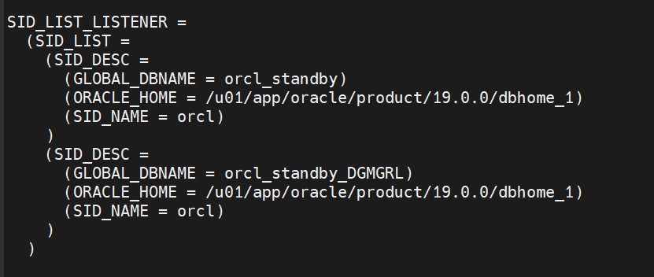
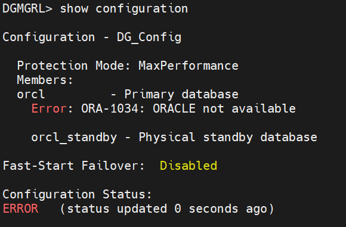
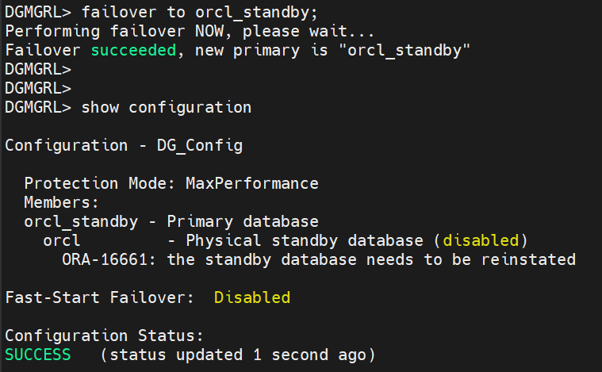

# Automasi: Oracle Data Guard Broker (DGMGRL)

Mengonfigurasi DGMGRL, sehingga nanti kalau kita mau pindah Primary ke Standby, kita cukup mengetik satu baris perintah saja di terminal: `switchover to exastandby;` dan biarkan Oracle yang mengurus sisanya.

---

## 1. Menyalakan Mesin Broker Data Guard Monitor (DMON) di Kedua Server

Buka SQL\*Plus di server **Primary (exaprimary)**, lalu jalankan:

```sql
alter system set DG_BROKER_START=TRUE;
```

Buka SQL\*Plus di server **Standby (exastandby)**, lalu jalankan:

```sql
alter system set DG_BROKER_START=TRUE;
```

---

## 2. Mendaftarkan Konfigurasi di Primary (Terminal Linux)

```bash
dgmgrl sys/123
```

---

## 3. Membuat Profil untuk Database Primary

```sql
CREATE CONFIGURATION 'DG_Config' AS PRIMARY DATABASE IS orcl CONNECT IDENTIFIER IS exaprimary;
```

Jika sudah success:

```bash
exit;
```

> **Catatan:** `"orcl"` sesuaikan dengan nama `db_unique_name` kalian.
>
> Cara cek `db_unique_name`:
> ```sql
> show parameter db_unique_name;
> ```

---

## 4. Buka File `listener.ora` di Server Standby (exastandby)

```bash
nano $ORACLE_HOME/network/admin/listener.ora
```

---

## 5. Pastikan Blok `SID_LIST_LISTENER` Sudah Terdaftar

Pastikan di dalam blok `SID_LIST_LISTENER` sudah terdaftar sidik jari database standby kamu dengan akhiran `_DGMGRL`.

**Tambahan script:**

```
=== Script ===

(SID_DESC =
      (GLOBAL_DBNAME = orcl_standby_DGMGRL)
      (ORACLE_HOME = /u01/app/oracle/product/19.0.0/dbhome_1)
      (SID_NAME = orcl)
)
```



Keluar dengan `Ctrl + X`, lalu pilih **"yes"** dan **"Enter"**.

---

## 6. Reload Listener

```bash
lsnrctl reload
```

---

## 7. Tes Koneksi Ulang Menggunakan Alias yang Benar (Primary)

```bash
dgmgrl sys/123@ORCL_STANDBY "show database orcl_standby"
```

Jika status sudah terhubung:

```bash
exit;
```

Masuk kembali ke:

```bash
dgmgrl sys/123
```

---

## 8. Tambahkan Standby Menggunakan Alias ORCL_STANDBY

> Sesuaikan namanya dengan yang ada di `tnsnames.ora` kalian.

```sql
ADD DATABASE orcl_standby AS CONNECT IDENTIFIER IS ORCL_STANDBY MAINTAINED AS PHYSICAL;
```

**Kalau ada error ini:**

```
Error: ORA-16698: member has a LOG_ARCHIVE_DEST_n parameter with SERVICE attribute set
```

Artinya begini: Broker itu adalah manajer yang sangat otoriter. Dia ingin **mengatur sendiri** jalur pengiriman archivelog antar-server. Ketika kamu mencoba mendaftarkan `orcl_standby`, Broker melihat bahwa di parameter database kamu saat ini, masih ada sisa konfigurasi manual pengiriman log (`LOG_ARCHIVE_DEST_n` yang mengarah ke `SERVICE=...`) hasil dari lab Data Guard manual sebelumnya. Broker tidak suka ada "tumpang tindih" kekuasaan.

Untuk menyelesaikannya, kita cukup mengosongkan parameter pengiriman manual tersebut agar Broker bisa mengambil alih kendali dengan bersih.

---

## 9. Kosongkan Parameter di Kedua Sisi SQL*Plus (Primary dan Standby)

```sql
ALTER SYSTEM SET LOG_ARCHIVE_DEST_2='' SCOPE=BOTH;
```

> **Catatan:** Jika di lab sebelumnya kamu memakai nomor destinasi lain seperti `LOG_ARCHIVE_DEST_3`, sesuaikan angkanya. Cara cek:
> ```sql
> show parameter LOG_ARCHIVE_DEST_;
> ```

---

## 10. Eksekusi Ulang di DGMGRL Primary

```sql
ADD DATABASE orcl_standby AS CONNECT IDENTIFIER IS ORCL_STANDBY MAINTAINED AS PHYSICAL;
```

Sekarang seharusnya hasilnya: `Database "orcl_standby" added.`

---

## 11. Hidupkan "Manajer Otomatis" (DGMGRL di Primary)

Hidupkan agar dia mulai mengambil alih kendali penuh di kedua server:

```sql
ENABLE CONFIGURATION;
```

---

## 12. Cek Status Konfigurasi

Setelah statusnya Success, cek juga dengan:

```sql
SHOW CONFIGURATION;
```

```sql
ENABLE CONFIGURATION;
```

Jika statusnya **Success** maka kita sudah **BERHASIL** melakukan *"Automasi: Oracle Data Guard Broker"*.

> **Node:**
> Jika statusnya dicek ada **"warning"** maka jalankan:
>
> Di SQL\*Plus Primary:
> ```sql
> ALTER SYSTEM SWITCH LOGFILE;
> ```
>
> Cek lagi di DGMGRL:
> ```sql
> SHOW CONFIGURATION;
> ```

---

## === SIMULASI FAIL OVER ===

Ini simulasi dimana Server Primary kita mati mendadak, dan menggantinya Server Standby kita menjadi Primary yang baru.

### 1. "SABOTASE" Server Primary (Kita Bikin Mati Total)

```sql
sqlplus / as sysdba
```

```sql
shut abort
```

---

### 2. Eksekusi Failover di Server Standby

Masuk ke terminal Standby dan jalankan DGMGRL:

```bash
dgmgrl sys/123
```

---

### 3. Cek Status Konfigurasi untuk Melihat Kehancuran Primary

```sql
show configuration;
```



Hasilnya akan error karena mendeteksi database `orcl` (Primary) di sebelah sudah hilang dari radar jaringan.

---

### 4. Selamatkan dengan Mengangkat Standby Menjadi Primary Baru

```sql
failover to orcl_standby;
```

Jika sudah Success maka cek konfigurasinya:

```sql
show configuration
```



- **`orcl_standby - Primary database`**: Server Standby kamu sekarang sudah resmi naik takhta menjadi yang memegang kendali (Read-Write).
- **`orcl - Physical standby database (disabled)`**: Server Primary lama kamu sekarang statusnya lumpuh (disabled) dan turun kasta menjadi Standby.
- **`ORA-16661: the standby database needs to be reinstated`**: Ini adalah pesan dari Broker yang meminta kamu untuk melakukan **Reinstate** (rehabilitasi). Broker memberi tahu bahwa database `orcl` yang lama sempat pingsan dan tertinggal datanya, sehingga perlu disinkronkan ulang agar bisa menjadi Standby yang sah bagi Primary baru kita (`orcl_standby`).

---

### 5. Nyalakan Primary Lama ke Mode Mount (Persiapan Reinstate)

```sql
startup mount;
```

---

### 6. Eksekusi Perintah REINSTATE dari Primary yang Baru (Standby) di DGMGRL

```sql
REINSTATE DATABASE orcl;
```

Di sini broker akan otomatis mendeteksi database `orcl`, membersihkan sisa data konflik akibat *failover* kemarin, lalu memutar ulang aliran *archivelog* dari `orcl_standby` untuk menambal ketertinggalan data di `orcl`.

Tunggu sampai hasilnya **Success**.

---

### 7. Evaluasi Hasil Akhir

```sql
show configuration;
```

Sekarang posisinya resmi berbalik:

- **`orcl_standby`** adalah Primary (Bos Baru).
- **`orcl`** adalah Physical Standby (Anak Buah Baru).

Karena semuanya sudah sehat 100%, kalau kita ingin mengembalikan posisi server ke tatanan awal (di mana `orcl` kembali jadi Primary dan `orcl_standby` kembali jadi Standby), kita tidak perlu merusaknya lagi pakai FAILOVER.

Karena kedua server sekarang sama-sama hidup dan sehat, kamu bisa melakukan **Tukar Peran Damai (Switchover)** langsung dari prompt DGMGRL saat ini:

```sql
SWITCHOVER TO orcl;
```

![show configuration setelah switchover kembali ke posisi awal]

Begitu perintah itu selesai, posisinya akan otomatis berputar kembali ke setelan pabrik seperti awal.

---

## Kesimpulan

Implementasi Data Guard Broker 19c terbukti memangkas kompleksitas administrasi saat terjadi *disaster*. Proses Failover, Reinstate, hingga Switchover yang tadinya membutuhkan puluhan baris perintah manual di SQL\*Plus, kini dapat ditangani secara aman, cepat, dan otomatis lewat satu baris perintah di konsol DGMGRL dengan status akhir pemulihan 100% sinkron.

---

*Dibuat oleh **Naufal Ali Hilmi** | Information Systems Student, Gunadarma University*
