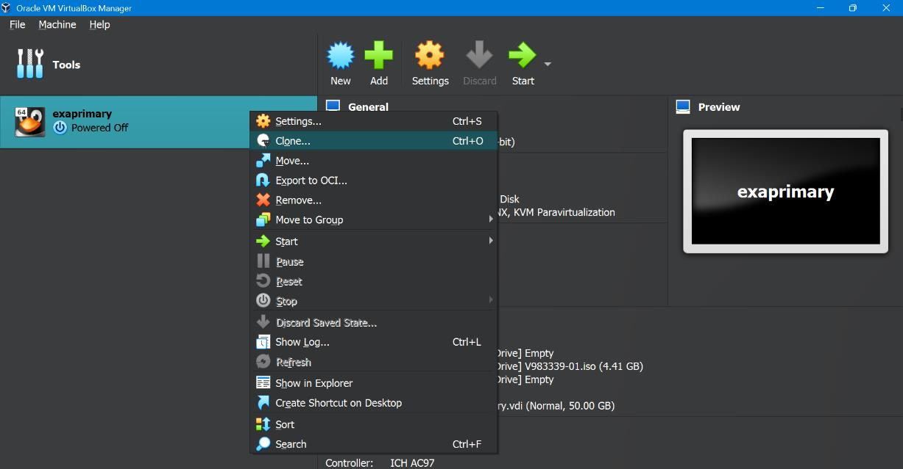
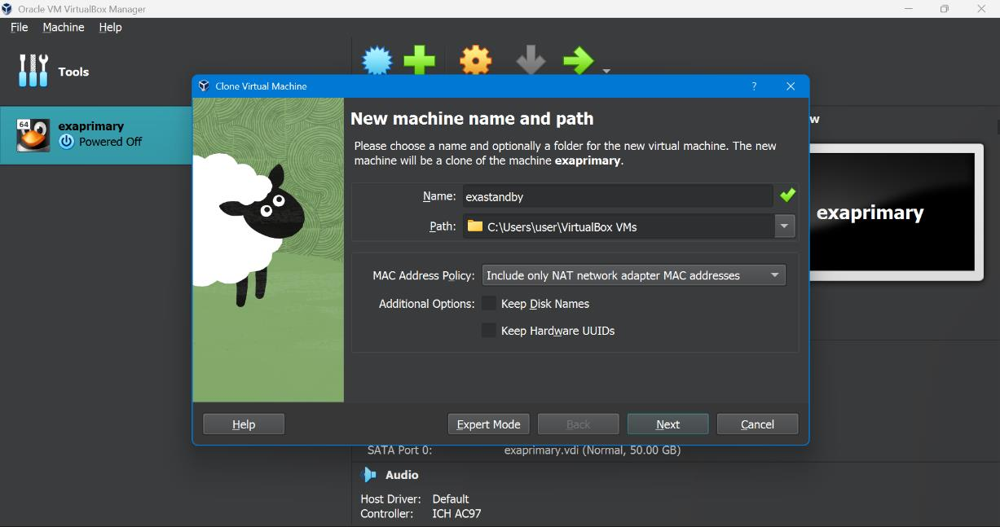
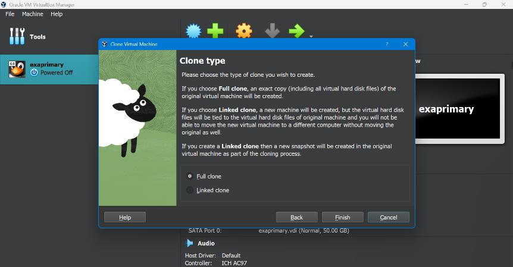
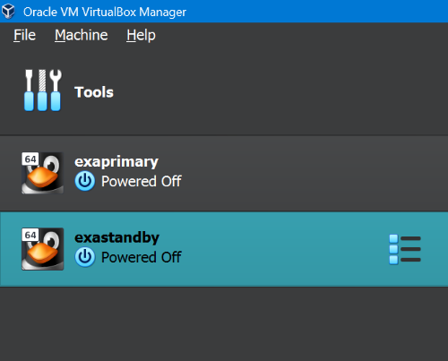
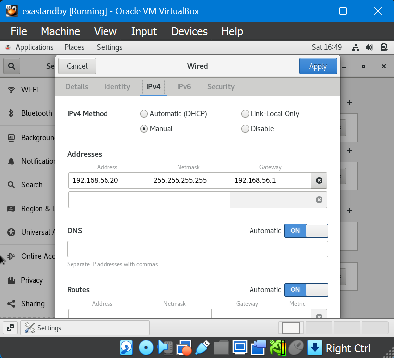
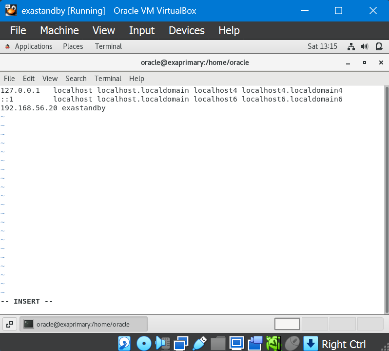
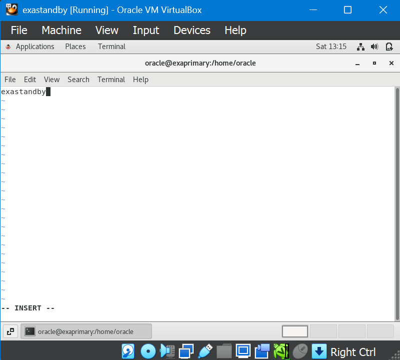
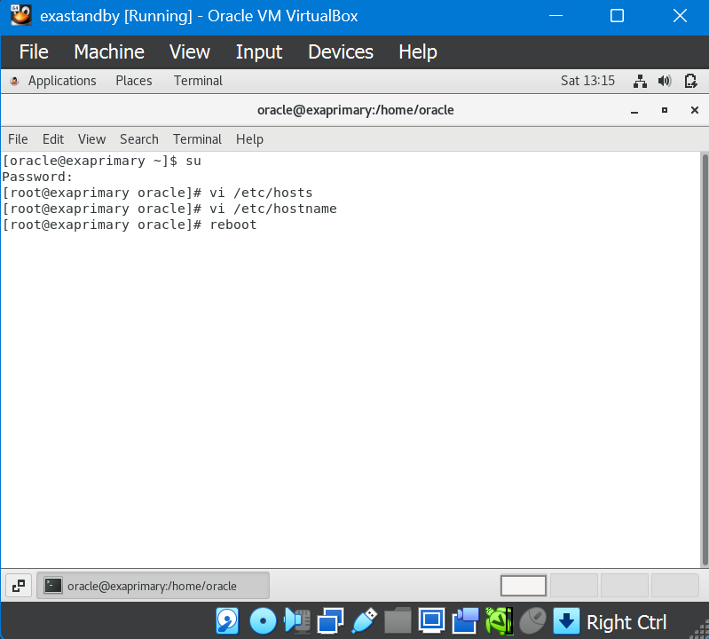
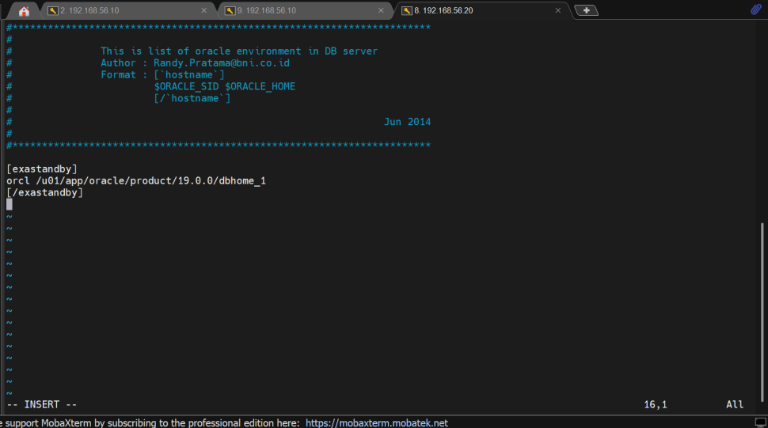
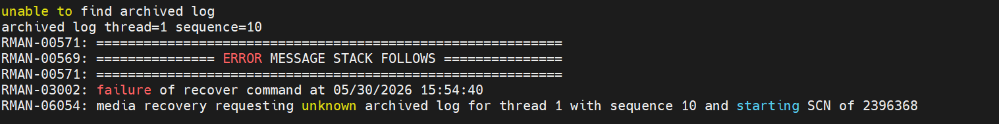

# Backup & Recovery Cross Server

---

## BACKUP

### 1. Membuat folder backup dan script terlebih dahulu

```bash
mkdir -p backup
mkdir -p script
```

---

### 2. Di dalam folder backup, membuat folder untuk menyimpan backup-nya

```bash
mkdir -p DBPERTAMA
mkdir -p DBPERTAMA_log
```

---

### 3. Masuk ke sqlplus, aktifkan archivelog

```sql
startup mount;
```

Lalu nyalakan archivelog-nya:

```sql
alter database archivelog;
```

Lihat statusnya:

```sql
archive log list;
```

Memastikan status open mode pada database, jika masih mounted lakukan open:

```sql
select name, open_mode, database_role from v$database;
```

Menaikkan status dari mount ke open:

```sql
alter database open;
```

---

### 4. Masuk ke folder script, lalu buat file backup script

```bash
vi backup_DBBELANJATUGAS.sh
```

---

### 5. Masukkan script backup berikut ini

```bash
#!/bin/bash
# =============================================================
# Oracle RMAN Backup Script with Auto-Dated Directory
# =============================================================

# --- Konfigurasi dasar environment ---
export ORACLE_SID=orcl
export ORACLE_BASE=/u01/app/oracle
export ORACLE_HOME=/u01/app/oracle/product/19.0.0/dbhome_1
export ORACLE_HOSTNAME=exaprimary
export PATH=$PATH:$ORACLE_HOME/bin

# --- Buat format tanggal dan direktori backup ---
DATE_DIR=$(date +%Y-%m-%d)
DATETIME=$(date +%d%m%y_%H%M%S)
BACKUP_BASE="/home/oracle/backup/DBBELANJATUGAS"
BACKUP_DIR="${BACKUP_BASE}/${DATE_DIR}"
LOG_DIR="/home/oracle/backup/DBBELANJATUGAS_log"

# --- Buat direktori jika belum ada ---
mkdir -p "${BACKUP_DIR}"
mkdir -p "${LOG_DIR}"

# --- Jalankan RMAN Backup ---
${ORACLE_HOME}/bin/rman target=/ log="${LOG_DIR}/alertbackupORCL_${DATETIME}.log" <<EOF
run
{
  crosscheck backup;
  crosscheck archivelog all;
  delete noprompt expired archivelog all;
  delete noprompt expired backup;

  backup as compressed backupset incremental level 0 database
    format '${BACKUP_DIR}/data_level0_%d_%s_%p_%c_%T.bkp';

  backup as compressed backupset incremental level 0 archivelog all
    format '${BACKUP_DIR}/archive_level0_%d_%s_%p_%c_%T.bak';

  backup current controlfile for standby
    format '${BACKUP_DIR}/standby_controlfile_level0_%d_%s_%p_%c_%T.bkp';

  backup current controlfile
    format '${BACKUP_DIR}/current_controlfile_level0_%d_%s_%p_%c_%T.bkp';
}
EXIT;
EOF
```

---

### 6. Setelah selesai meletakkan script, berikan permission agar script bisa dieksekusi

```bash
chmod +x backup_DBPERTAMA.sh
```

---

### 7. Lalu di folder script, jalankan file-nya

```bash
./backup_DBPERTAMA.sh
```

Selagi menunggu proses running-nya, cek log-nya:

---

### 8. Duplicate tab, lalu masuk ke folder backup dan masuk ke folder log

```bash
cd DBPERTAMA_log
```

untuk melihat `alert...`

---

### 9. Lalu cek progress dari running-nya

```bash
tail -f alertbackupORCL_040426_153708.log
```

Jika sudah selesai running, cek file backup-nya:

---

### 10. Setelah complete, masuk ke folder yang sudah kamu buat di folder backup (bukan `_log`)

```bash
cd DBBELANJATUGAS
```

---

### 11. Cek isi folder-nya

```bash
ls -lrt
```

---

### 12. Masuk ke folder waktu backup-annya

```bash
cd 2026-04-04
```

---

### 13. Untuk mengecek backup-annya bisa di folder backup

```bash
cd backup/
```

Kita sudah melakukan backup untuk server primary kita. Selanjutnya kita akan melakukan restore dari server primary ke server standby.

---

## Persiapan: Membuat Server Standby

Sebelum melakukan Recovery Cross, kita harus mempunyai 2 Server (Primary dan Standby). Karena kita sudah punya Server Primary, jadi tinggal buat Server Standby.

**Membuat Server Standby** — klik kanan pada VM `exaprimary` di VirtualBox → **Clone**:





---

Jika sudah, pilih tipe clone (Full clone) dan selesaikan proses cloning:





Jika sudah maka running server standby-nya, lalu setting alamat server-nya seperti yang kita lakukan di tahap awal (disetting network dan di terminal):





---





Jika sudah semua, langsung saja direboot.

---

## RECOVERY

Sekarang sudah punya 2 Server. Jalankan keduanya.

---

### 1. Masuk ke sqlplus, buat pfile dan spfile (Primary)

```sql
create pfile from spfile;
```

---

### 2. Masukkan database-nya ke db profile (Standby)

```bash
cd dba
vi .db_profile
```



---

### 3. Buat folder backup dan script di server standby

Buat folder backup dan script di server standby seperti yang dilakukan saat backup di primary tadi, beserta isi dari file backup-nya (standby).

---

### 4. Transfer folder backup dari Primary ke Standby (jalankan di Primary)

Masuk ke backup dan masuk ke folder DB-nya dan `pwd`, lalu transfer:

```bash
scp -r /home/oracle/backup/DBPERTAMA/2026-05-30 \
  oracle@192.168.56.20:/home/oracle/backup/DBPERTAMA
```

> **Catatan:** Setiap ada perintah yang menuliskan lokasi file-file, sesuaikan dengan lokasi file kalian sendiri. Agar tahu lokasi file tersebut, gunakan command `pwd`.

---

### 5. Transfer pfile dari Primary ke Standby (jalankan di Primary)

```bash
cd $ORACLE_HOME/dbs
scp initorcl.ora oracle@192.168.56.20:$ORACLE_HOME/dbs
```

---

### 6. Setelah itu, cat pfile yang sudah dibawa dari Primary di Standby (jalankan di Standby)

```bash
cd $ORACLE_HOME/dbs
cat initorcl.ora
```

---

### 7. Buatkan direktori-direktori yang belum ada di pfile (jalankan di Standby)

```bash
mkdir -p /u01/app/oracle/admin/orcl/adump
mkdir -p /u01/app/oracle/oradata/ORCL/controlfile/
mkdir -p /u01/app/oracle/fast_recovery_area/ORCL/controlfile/
mkdir -p /u01/app/oracle/fast_recovery_area
```

---

### 8. Masukkan script restore ke file yang kita buat di dalam folder script (Standby)

```bash
cd script
vi restore_DBPERTAMA.sh
```

**=== Script Restore ===**

```bash
#!/bin/bash

# Timestamp
DATETIME=$(date +%d%m%y%H%M%S)

# Oracle Environment
export ORACLE_SID=orcl
export ORACLE_BASE=/u01/app/oracle
export ORACLE_HOME=/u01/app/oracle/product/19.0.0/dbhome_1
export ORACLE_HOSTNAME=exastandby
export PATH=$PATH:$ORACLE_HOME/bin

LOGFILE=/home/oracle/backup/DBPERTAMA_log/restoreDBPERTAMA${DATETIME}.log

echo "Start Restore at $(date)"
echo "Log file: $LOGFILE"

${ORACLE_HOME}/bin/rman target / log=$LOGFILE <<EOF
run {
  restore database;
  switch datafile all;
  switch tempfile all;
  recover database;
}
alter database open resetlogs;
exit;
EOF

echo "Restore selesai pada $(date)"
```

---

### 9. Startup nomount menggunakan pfile yang dibawa dari Primary di SQL (Standby)

Cek lokasi file dengan `pwd` di Oracle Home dbs, lalu ke sqlplus jalankan:

```sql
startup nomount pfile='/u01/app/oracle/product/19.0.0/dbhome_1/dbs/initorcl.ora';
```

---

### 10. Keluar dari SQL, lalu masuk ke RMAN (Standby)

```bash
rman target /
```

---

### 11. Cek file di folder backup (Standby)

```bash
cd backup/DBPERTAMA
ls -lrt
pwd
```

---

### 12. Restore controlfile (jalankan di RMAN, Standby)

Untuk **current control file**:

```rman
restore controlfile from '/home/oracle/backup/DBPERTAMA/2026-05-30/current_controlfile_level0_ORCL_8_1_1_20260530.bkp';
```

Untuk **standby control file**:

```rman
restore standby controlfile from '/home/oracle/backup/DBPERTAMA/2026-04-21/standby_controlfile_level0_ORCL_178_1_1_20260421.bkp';
```

---

### 13. Lakukan `alter database mount` di RMAN (Standby)

```rman
alter database mount;
```

---

### 14. Lakukan crosscheck backup di RMAN (Standby)

```rman
crosscheck backup;
catalog start with '/home/oracle/backup/DBPERTAMA/2026-05-30';
```

---

### 15. Jalankan script restore yang sudah disiapkan di awal di folder script (Standby)

```bash
./restore_rexprimary.sh
```

---

### 16. Cek log-nya di duplikat (Standby)

```bash
tail -f /home/oracle/backup/DBPERTAMA_log/restoreDBPERTAMA300526155334.log
```

Tinggal tunggu apakah proses restore-nya berhasil atau tidak — seharusnya **Sukses**.

Jika ada error seperti ini, tenang saja:



> Setelah Sequence 9 selesai diterapkan, RMAN secara otomatis akan mencari Sequence 10 untuk memastikan apakah masih ada data kelanjutannya. Karena Sequence 10 tidak ada di dalam backup Anda, RMAN berhenti dan mengeluarkan error tersebut.
>
> **Artinya:** Database kita sebenarnya sudah berhasil dipulihkan hingga titik maksimal dari seluruh log backup yang kita miliki. RMAN bukan gagal, dia hanya kehabisan file log untuk dibaca.

---

### 17. Setelah berhasil melakukan Restore, jangan lupa buatkan pfile dan spfile di SQL (Standby)

```sql
create pfile from spfile;
create spfile from pfile;
```

---

**SELAMAT!!! Kita sudah berhasil melakukan proses Backup dan Restore…**

---

*Dibuat oleh Naufal Ali Hilmi | Information Systems Student, Gunadarma University*
