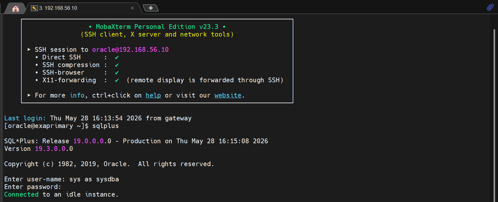
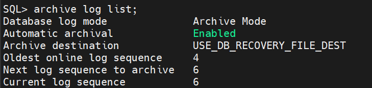
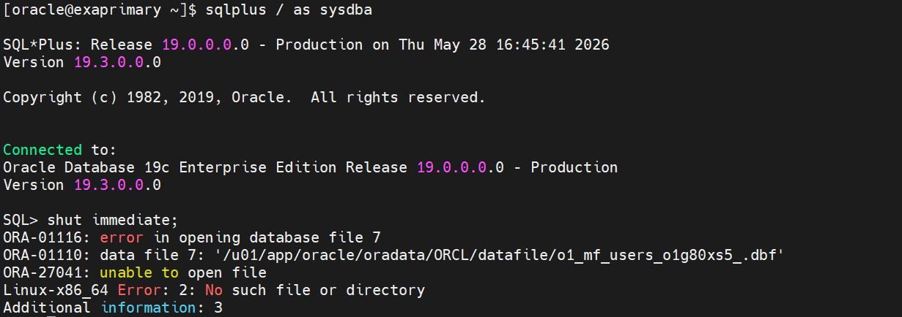
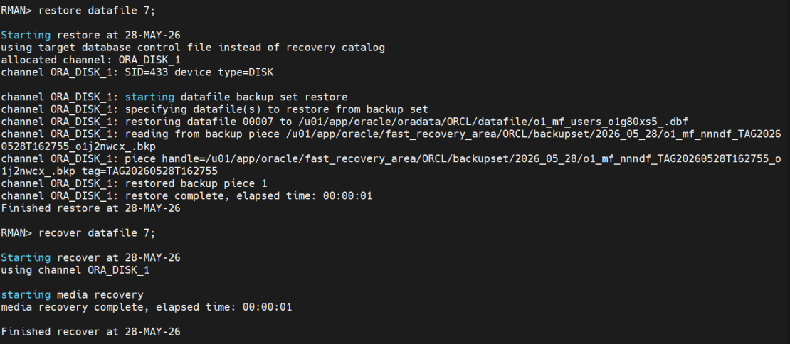
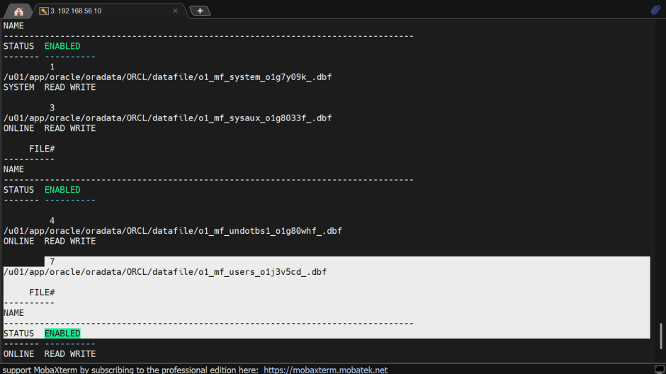
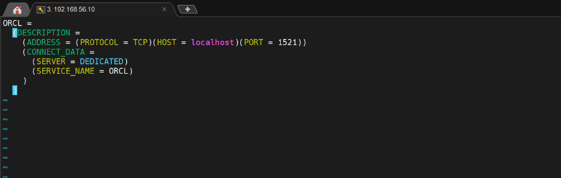
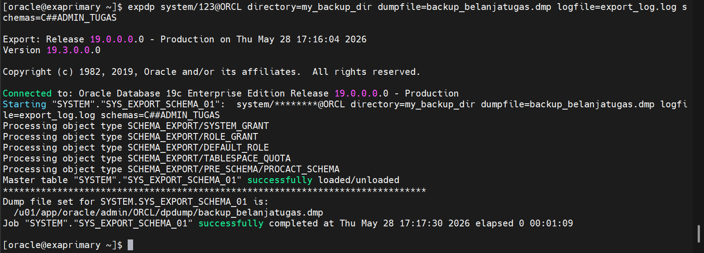
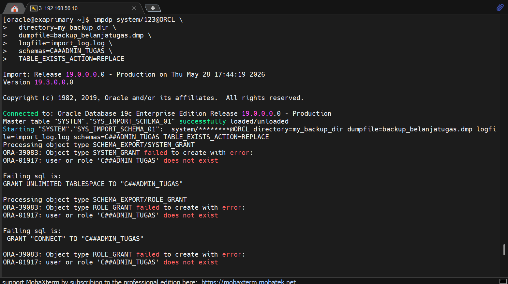
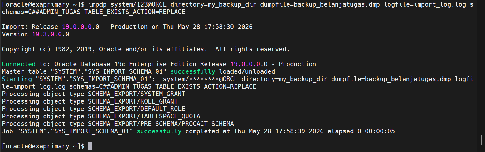

# BACKUP 1 SERVER

---

## Persiapan: Aktifkan Archive Log

### 1. Pertama, masuk ke sqlplus seperti di foto ini



---

### 2. Menyalakan SQL-nya dengan:

```sql
startup
```

---

### 3. Cek status Archive Log-nya

```sql
select log_mode from v$database;
```

Jika belum nyala, maka kita nyalakan archive log-nya terlebih dahulu.

---

### 4. Matikan dan nyalakan SQL-nya menjadi mount

```sql
shut immediate;
startup mount;
```

---

### 5. Lalu tinggal nyalakan archive log-nya

```sql
alter database archivelog;
alter database open;
archive log list;
```

Hasilnya akan seperti ini jika sudah nyala:



---

### 6. Backup Database beserta Archivelog

Lalu kita akan membackup Database beserta Archivelog kita, agar suatu hari nanti jika terjadi apa-apa kita tinggal restore, sudah ada backup-annya.

Keluar dari SQL, lalu masuk ke RMAN:

```bash
exit;
rman target /
```

Jalankan backup:

```bash
backup database plus archivelog;
list backup;
```

Jika berhasil:

> **Hasil:** RMAN berhasil melakukan backup ke direktori Fast Recovery Area (FRA) yaitu `/u01/app/oracle/fast_recovery_area/ORCL/backupset/`.

```bash
exit;
```

Jadi kita sudah berhasil membackup database beserta archivelog di server kita.

---

## === Simulasi Skenario ===

---

## A. Simulasi Kerusakan dan Restore Datafile

Skenario ini menyimulasikan hilangnya datafile 7 (users tablespace) secara tidak sengaja di tingkat OS (menggunakan command `rm`), sehingga menyebabkan database crash.

---

### 1. Penghapusan File (Simulasi Error)

```bash
rm /u01/app/oracle/oradata/ORCL/datafile/o1_mf_users_nwbh9cg0_.dbf
```

---

### 2. Identifikasi Kerusakan

Saat dicoba dimatikan dengan `shut immediate`, muncul error **ORA-01116** dan **ORA-01110**.



Database kemudian di-shutdown paksa dengan `shut abort` dan dihidupkan sampai tahap mount:

```sql
shut abort;
startup mount;
```

---

### 3. Proses Restore dan Recover

Masuk ke RMAN dan jalankan restore:

```bash
rman target /
```

```rman
restore datafile 7;
recover datafile 7;
alter database open;
```



Masuk ke SQL untuk mengecek apakah file-nya sudah ada atau belum:

```sql
DESC v$datafile;
SELECT file#, name, status, enabled FROM v$datafile;
```

**Hasil:** Datafile 7 berhasil di-restore dan di-recover sepenuhnya. Database kembali dalam status **OPEN**.



---

## B. Logical Backup dengan Data Pump (expdp & impdp)

Proses ini bertujuan untuk mengekspor skema `C##ADMIN_TUGAS` dan mengimpornya kembali. Sempat terjadi kendala pada Listener dan User Role.

---

### 1. Membuat Directory Objek

```bash
mkdir -p /u01/app/oracle/admin/ORCL/dpdump
```

---

### 2. Masuk ke SQL untuk membuat direktori dan memberi akses direktori tersebut ke sistem

```sql
create or replace directory my_backup_dir as '/u01/app/oracle/admin/ORCL/dpdump';
GRANT READ, WRITE ON DIRECTORY my_backup_dir TO system;
```

---

### 3. Lalu keluar dari SQL, dan nyalakan listener control-nya

```bash
lsnrctl start
```

---

### 4. Membuat tnsnames untuk dapat mengecek ping (terhubung dengan listener atau tidak) dengan tnsping

```bash
vi $ORACLE_HOME/network/admin/tnsnames.ora
```

**=== SCRIPT ===**



Lalu cek ping-nya:

```bash
tnsping ORCL
```

Jika hasilnya berhasil terhubung maka kita sudah siap untuk ekspor dan impor.

---

### 5. Membuat User dan Ekspor Data

Karena skema `C##ADMIN_TUGAS` belum ada, dilakukan pembuatan user terlebih dahulu sebelum diekspor.

Masuk ke SQL lalu:

```sql
ALTER SESSION SET "_ORACLE_SCRIPT"=TRUE;
CREATE USER "C##ADMIN_TUGAS" IDENTIFIED BY "123";
GRANT CONNECT, RESOURCE, DBA TO "C##ADMIN_TUGAS";
ALTER USER C##ADMIN_TUGAS QUOTA UNLIMITED ON USERS;
exit;
```

Lalu tinggal export skema `C##ADMIN_TUGAS` ke direktori yang tadi kita buat:

```bash
expdp system/123@ORCL directory=my_backup_dir dumpfile=backup_belanjatugas.dmp \
logfile=export_log.log schemas=C##ADMIN_TUGAS
```



> **Catatan:** Jika sudah seperti ini, ekspor berhasil. Namun karena skema belum memiliki tabel, maka yang terekspor hanya metadata (role, grants, quota).

---

### 6. Simulasi: Hapus Skema (Simulasi jika suatu saat tidak sengaja menghapus sesuatu)

```sql
ALTER SESSION SET "_ORACLE_SCRIPT"=TRUE;
DROP USER C##ADMIN_TUGAS CASCADE;
```

Verifikasi untuk memastikan user sudah hilang:

```sql
SELECT username FROM dba_users WHERE username = 'C##ADMIN_TUGAS';
```

**Hasil:** `no rows selected`

---

### 7. Jika kita langsung Import maka akan mengalami error seperti ini



> **Alasan Error ORA-01917:** Sebenarnya, `impdp` bisa membuat user secara otomatis jika kita menggunakan user biasa (Local User). Namun, karena menggunakan **Common User** (`C##ADMIN_TUGAS`) di Oracle 19c (arsitektur Container/Multitenant), Oracle memberikan proteksi keamanan yang sangat ketat. Di Oracle 19c, membuat user beratribut `C##` memerlukan parameter khusus di latar belakang yaitu `_ORACLE_SCRIPT=TRUE`.
>
> Karena utilitas `impdp` berjalan sebagai background job otomatis, dia tidak bisa mengaktifkan parameter tersebut sendiri saat mencoba mengeksekusi perintah `CREATE USER "C##ADMIN_TUGAS"`, sehingga prosesnya digagalkan oleh sistem Oracle dan memicu error **ORA-01917**.

---

### 8. Solusi: Buat ulang struktur dasar user (Infrastruktur/Metadata) di SQL terlebih dahulu

```sql
ALTER SESSION SET "_ORACLE_SCRIPT"=TRUE;
CREATE USER C##ADMIN_TUGAS IDENTIFIED BY 123;
GRANT CONNECT, RESOURCE, DBA TO C##ADMIN_TUGAS;
ALTER USER C##ADMIN_TUGAS QUOTA UNLIMITED ON USERS;
```

---

### 9. Setelah user dasar dibuat kembali, jalankan perintah import di Terminal Linux (bukan di SQL\*Plus)

```bash
impdp system/123@ORCL directory=my_backup_dir dumpfile=backup_belanjatugas.dmp \
logfile=import_log.log schemas=C##ADMIN_TUGAS TABLE_EXISTS_ACTION=REPLACE
```



---

Jadi, kita sudah berhasil meng-import file yang tidak sengaja di-drop tadi dengan `impdp`.

Lalu pasti bingung, *"Kalau kita harus membuat user-nya lagi secara manual, lalu apa gunanya impdp?"*

Jawabannya adalah: **`impdp` bukan sekadar untuk membuat nama user, melainkan untuk mengembalikan seluruh "isi" dan aset di dalam skema tersebut.**

---

*Dibuat oleh Naufal Ali Hilmi | Information Systems Student, Gunadarma University*
