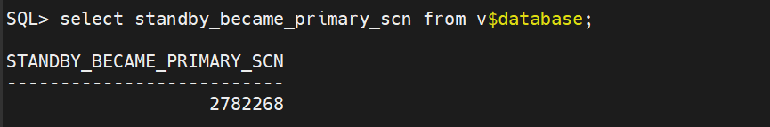

# Failover Manual & Reinstatement

## FAIL OVER

Ini terjadi jika tiba-tiba gedung data center tempat server utama kita (primary) berada mengalami mati lampu total, korsleting, atau tersambar petir. Server utama mati total dan tidak bisa dihubungi sama sekali.

Sebagai DBA yang bertugas, kita tidak punya waktu untuk melakukan Switchover (karena server utama tidak bisa merespons perintah serah terima jabatan). Di sinilah kita harus melakukan **Failover**.

Mari kita simulasikan bencana ini:

**1. Matikan paksa server utama** (seolah-olah hardware-nya rusak mendadak). Buka terminal server primary, lalu hancurkan operasinya:
```sql
shut abort;
```
Setelah itu, tutup terminal primary. Jangan disentuh lagi, anggap server ini sudah hangus terbakar.

Lalu di proses inilah kita mengganti server standby menjadi primary dengan paksa:

**2. Cek status internal standby:**
```sql
select database_role, switchover_status from v$database;
```
Karena Primary mati mendadak, statusnya pasti tidak akan menunjukkan `TO PRIMARY` secara normal.

**3. Hentikan proses Managed Recovery (MRP)** yang sedang kebingungan mencari Primary:
```sql
alter database recover managed standby database cancel;
```
> Jika hasilnya `ORA-16136: Managed Standby Recovery not active` tidak apa-apa, karena server Standby memang sudah otomatis mati atau tidak sedang aktif saat Primary dimatikan paksa.

**4. Paksa Standby mengambil alih (Eksekusi Failover):**
```sql
alter database activate physical standby database;
```

**5. Buka database** agar aplikasi bisa bertransaksi kembali:
```sql
alter database open;
```

**6. Cek hasilnya**, apakah server Standby sudah berhasil mengambil alih menjadi PRIMARY yang baru:
```sql
select database_role, switchover_status from v$database;
```
Jika hasilnya sudah menjadi `PRIMARY`, maka kita **BERHASIL**!

---

Failover sudah selesai, tetapi kita masih harus menyalakan primary kita kembali dan menjadikannya server primary utama lagi.

Ada **2 Skenario** di sini:
- **Cara Manual** — belum melakukan Flashback
- **Cara Reinstatement** — sudah melakukan Flashback sebelumnya

Cek status Flashback terlebih dahulu:
```sql
select flashback_on from v$database;
```
Jika belum aktif, hidupkan agar selanjutnya tidak perlu cara manual lagi:
```sql
alter database flashback on;
```

---

## Cara Manual (No Flashback)

**1. Masuk ke server primary, buka SQL:**
```sql
startup mount;
alter database convert to physical standby;
shut immediate;
startup mount;
```

**2. Sinkronisasi Data:**
```sql
alter database recover managed standby database disconnect from session;
```

**3. Turunkan pangkat di Server Primary Saat Ini** (Mantan Standby):
```sql
alter database commit to switchover to standby with session shutdown;
startup mount;
```

**4. Cek statusnya** di server utama (primary yang belum kembali menjadi primary):
```sql
select database_role, switchover_status from v$database;
```
> Hasil seharusnya: `TO PRIMARY | SESSIONS ACTIVE`

**5. Matikan proses recovery (MRP)** terlebih dahulu agar tidak memicu error:
```sql
alter database recover managed standby database cancel;
```

**6. Ubah status SQL menjadi nomount:**
```sql
shut immediate;
startup nomount;
```

**7. Masuk ke RMAN** untuk mengambil data langsung dari server Primary aktif dan menimpa/memperbaiki exaprimary:
```
rman TARGET sys/password_kamu@TNS_PRIMARY_SEBELAH AUXILIARY sys/password_kamu@TNS_EXAPRIMARY
```

**8. Eksekusi perintah duplikasi:**
```
DUPLICATE TARGET DATABASE FOR STANDBY FROM ACTIVE DATABASE NOFILENAMECHECK;
```

**9. Jika sudah berhasil**, keluar dari RMAN lalu masuk ke SQL:
```sql
shut immediate;
startup mount;
```

**10. Sinkronisasi data** untuk mengecek koneksi:
```sql
alter database recover managed standby database disconnect from session;
```
Lalu cek:
```sql
SELECT PROCESS, STATUS, SEQUENCE# FROM V$MANAGED_STANDBY WHERE PROCESS LIKE 'MRP%';
```

**11. Putuskan kembali** untuk melanjutkan perubahan status server:
```sql
alter database recover managed standby database cancel;
```

**12. Naikkan pangkat server menjadi primary:**
```sql
alter database commit to switchover to primary with session shutdown;
alter database open;
```

**13. Cek statusnya:**
```sql
select database_role, switchover_status from v$database;
```
Jika statusnya sudah `PRIMARY | TO STANDBY` kita sudah **BERHASIL**!

> Kita sudah melakukan Failover sampai kembali seperti semula sebelum kejadian bencana terjadi.

---

## Cara Reinstatement (Flashback)

**1. Mulai dari awal**, buat simulasi bencana:
```sql
shut abort;
```

**2. Failover — Naikkan Standby Menjadi Primary.** Matikan proses standby yang sedang menunggu exaprimary:
```sql
alter database recover managed standby database cancel;
```

**3. Terapkan sisa log darurat** yang masih ada:
```sql
alter database recover managed standby database finish;
```

**4. Paksa naik pangkat menjadi Primary:**
```sql
alter database commit to switchover to primary with session shutdown;
```

**5. Buka database** agar aplikasi bisa jalan lagi:
```sql
alter database open;
```

**6. Sekarang Standby sudah beralih jadi Primary.** Ambil nilai SCN untuk proses Reinstatement:
```sql
select standby_became_primary_scn from v$database;
```
Catat angka yang muncul dari kueri, contoh:



**7. Masuk ke server utama**, nyalakan sebagai mount:
```sql
startup mount;
```

**8. Gunakan Flashback** menggunakan angka SCN yang didapat tadi:
```sql
flashback database to scn ANGKA_SCN;
```

**9. Ubah peran server** dengan aman:
```sql
alter database convert to physical standby;
```

**10. Restart singkat** untuk menyegarkan memori control file:
```sql
shut immediate;
startup mount;
```

**11. Nyalakan proses sinkronisasi** ke Primary yang baru:
```sql
alter database recover managed standby database disconnect from session;
```

**12. Cek apakah exaprimary berhasil terconnect** dan berstatus `WAIT_FOR_LOG`:
```sql
SELECT PROCESS, STATUS, SEQUENCE# FROM V$MANAGED_STANDBY WHERE PROCESS LIKE 'MRP%';
```

**13. Jika sudah terconnect**, turunkan pangkat exastandby (Primary saat ini):
```sql
alter database commit to switchover to standby with session shutdown;
startup mount;
```

**14. Naikkan pangkat exaprimary** (Standby yang mau jadi Primary lagi):
```sql
alter database recover managed standby database cancel;
alter database commit to switchover to primary with session shutdown;
alter database open;
```

**15. Kembali ke server exastandby** (yang sekarang sudah jadi Standby kembali), lalu nyalakan proses recovery-nya:
```sql
alter database recover managed standby database disconnect from session;
```

**16. Cek status di kedua server:**
```sql
select database_role, switchover_status from v$database;
```

Kita sudah **BERHASIL** melakukan Failover dengan cara Reinstatement menggunakan Flashback! 🎉

> Jika dibandingkan dengan cara manual, cara ini lebih efisien dan simple.

---

*Dibuat oleh Naufal Ali Hilmi | Information Systems Student, Gunadarma University*
