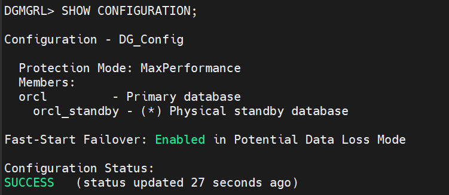
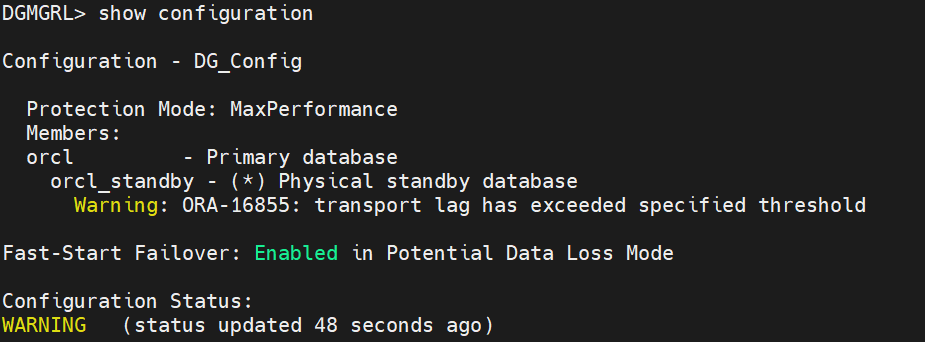
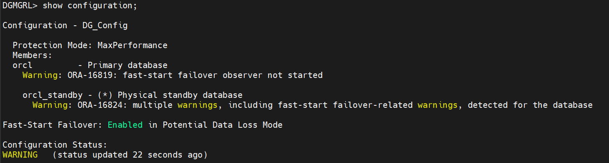

# Fast Start Failover (FSFO)

Di lab sebelumnya, waktu server mati, kita harus lari ke terminal dan mengetik `FAILOVER TO orcl_standby;` secara manual.

Dengan FSFO, kita akan mempekerjakan sebuah **"Robot Wasit"** yang disebut **Observer**. Tugas Observer cuma satu: Melototin Primary dan Standby 24 jam nonstop. Kalau dia melihat Primary mati mendadak dan tidak bisa dihubungi dalam waktu tertentu (misalnya 30 detik), Observer akan otomatis mengeksekusi perintah Failover ke Standby tanpa perlu kamu bangun dari kasur!

Sebelum kita nyalakan FSFO, ada satu syarat mutlak dari Oracle: **Kedua database (Primary dan Standby) WAJIB mengaktifkan fitur FLASHBACK DATABASE.**

```sql
ALTER DATABASE FLASHBACK ON;
```

---

## Langkah-Langkah Konfigurasi FSFO

### 1. Tentukan Target Failover di DGMGRL

Boleh dijalankan di primary maupun standby.

```bash
dgmgrl sys/123
```

```sql
EDIT DATABASE orcl SET PROPERTY FastStartFailoverTarget='orcl_standby';
EDIT DATABASE orcl_standby SET PROPERTY FastStartFailoverTarget='orcl';
```

> Hasilnya harus muncul Property `"faststartfailovertarget"` updated di masing-masing baris.

---

### 2. Nyalakan Fitur Autopilot

```sql
enable fast_start failover;
```

---

### 3. Cek Konfigurasi

Setelah hasilnya `"Enabled in Potential Data Loss Mode."`, cek konfigurasi seperti biasa:

```sql
show configuration;
```

---

### 4. Jika Hasilnya Seperti Ini



Status **WARNING** dan dua error yang muncul (`ORA-16819` & `ORA-16824`) itu justru kabar baik — Broker sedang protes:
> *"Woi, fitur autopilot (FSFO) sudah saya nyalakan, tapi mana Observer-nya? Kok belum ada yang jaga?"*

> Biasanya Observer dijalankan di server ke-3. Karena kita sekarang sedang lab sendiri, kita bisa membangun Observer-nya di server Standby saja.

---

## Cara Menjalankan Observer

### 1. Duplikat Session Standby, Lalu Jalankan

```bash
dgmgrl sys/123 "START OBSERVER"
```

**Hasil:** Layar terminal tersebut akan seperti hang atau diam dan memunculkan tulisan:
```
Observer 'exastandby' started
```

> Biarkan saja terminal itu terbuka dan **jangan ditekan Ctrl+C** — karena terminal itulah yang akan memantau server kita (Observer).

---

### 2. Cek Kembali Konfigurasinya

```sql
show configuration;
```



**Hasilnya:**

- **Try to connect to the primary:** Begitu nyala, dia langsung mencari di mana server Primary kita.
- **The standby orcl_standby is ready to be a FSFO target:** Dia mencatat bahwa Standby sudah siaga penuh mengambil alih status Primary.
- **Connection to the primary restored!:** Dia berhasil membangun jembatan pengawasan ke Primary (`orcl`).

---

## Mengatasi Error ORA-16855

Jika dapat error `"ORA-16855: transport lag has exceeded specified threshold"`, ikuti langkah berikut:

### 1. Longgarkan Aturan Sensitivitas Lag

```sql
EDIT CONFIGURATION SET PROPERTY FastStartFailoverThreshold = 60;
```

### 2. Paksa Siklus Log (Di SQL Server Primary)

Paksa database Primary untuk menutup lembaran log lama dan mengirimkan log baru yang segar agar antreannya cepat terkuras. Jalankan jika *Redo Log* tampak tertunda atau macet:

```sql
alter system switch logfile;
```

### 3. Cek Status Database

```sql
show database orcl
show database orcl_standby
```

### 4. Tunggu dan Cek Ulang Konfigurasi

Tunggu beberapa detik, lalu cek ulang apakah sudah aman:

```sql
show configuration;
```



Kalau sudah seperti ini maka kita sudah **BERHASIL** melakukan FSFO (Fast Start Failover)…

---

*Dibuat oleh **Naufal Ali Hilmi** | Information Systems Student, Gunadarma University*
